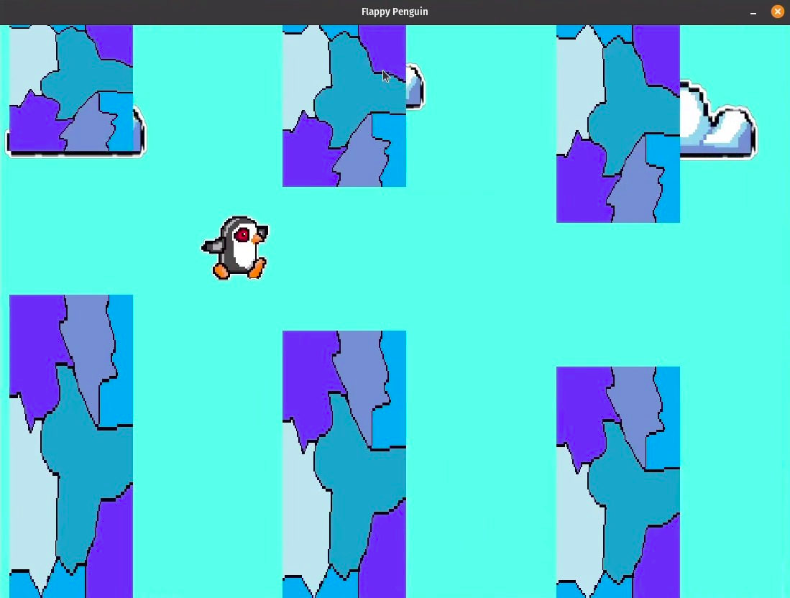

# Flappy Penguin

2D game made in OpenGL with a penguin that defies gravity.

## Wanna play it?

You'll be addicted...don't say I didn't warn ya!

1. Just clone the repo

```
git clone https://github.com/sirbuig/flappy-penguin.git
```

2. Create a build directory

```
mkdir cmake-build-debug
cd cmake-build-debug/
```

3. Run `cmake`

```
cmake ..
```

4. Run `make`

```
make
```

5. Have fun!

```
./main
```

## Showcase



## Contributors

Created with :heart: and a lot of :joy: by:

- https://github.com/sirbuig
- https://github.com/ZugravuAlexandra
- https://github.com/TeonaB
